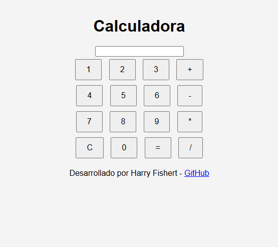

# Calculadora

Este es un proyecto básico de calculadora desarrollado con **HTML**, **CSS** y **JavaScript**. La calculadora permite realizar operaciones matemáticas básicas de manera interactiva.

---

## Características

- **Operaciones básicas**: suma, resta, multiplicación y división.
- **Pantalla de visualización**: muestra las operaciones y resultados.
- **Botón de limpieza**: permite reiniciar la calculadora.
- **Evaluación de expresiones matemáticas**: los cálculos se realizan dinámicamente.
- **Diseño responsivo**: adaptado para diferentes tamaños de pantalla.

---

## Requisitos

- Navegador web moderno con soporte para HTML5, CSS3 y JavaScript.

---
## Preview



---

## Cómo Usar

1. Clona este repositorio en tu máquina local:
    ```bash
    git clone https://github.com/tu-usuario/calculadora.git
    ```
2. Abre el archivo `index.html` en tu navegador web.
3. Usa los botones de la calculadora para realizar operaciones matemáticas.

---
-Desarrollado por **Harry Fishert**.  
